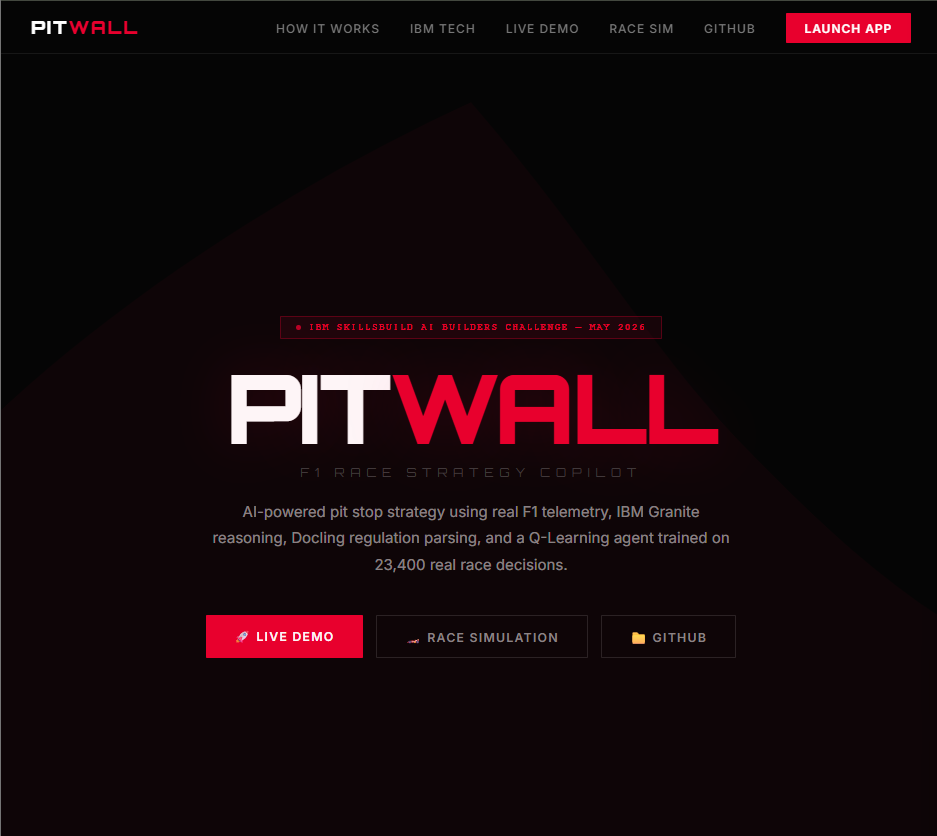
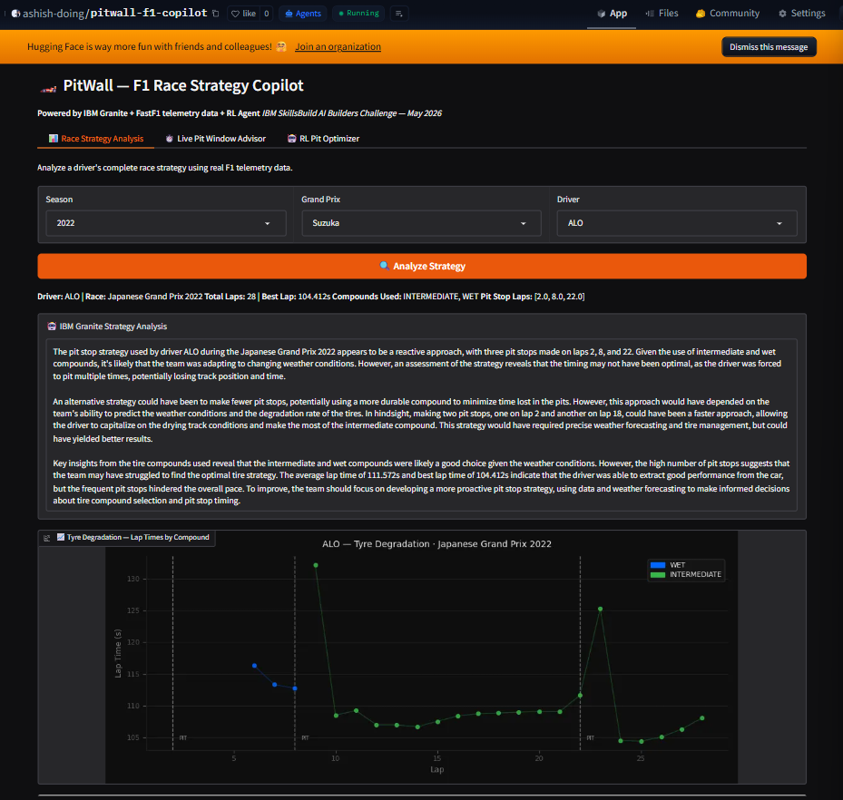
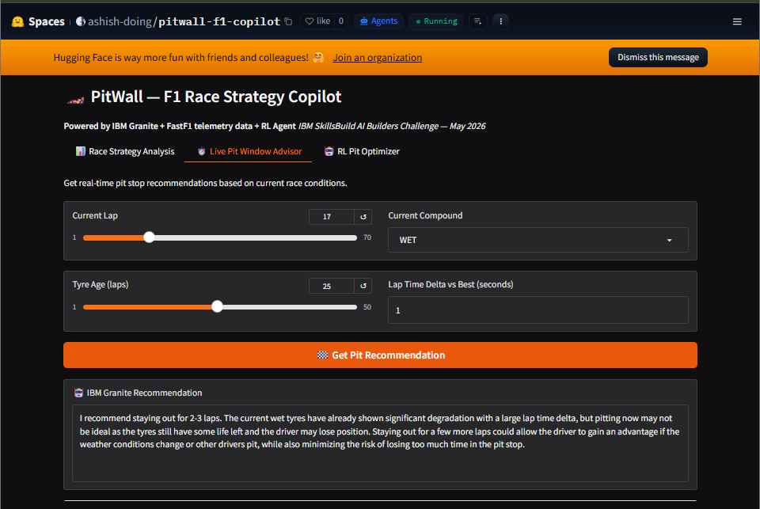
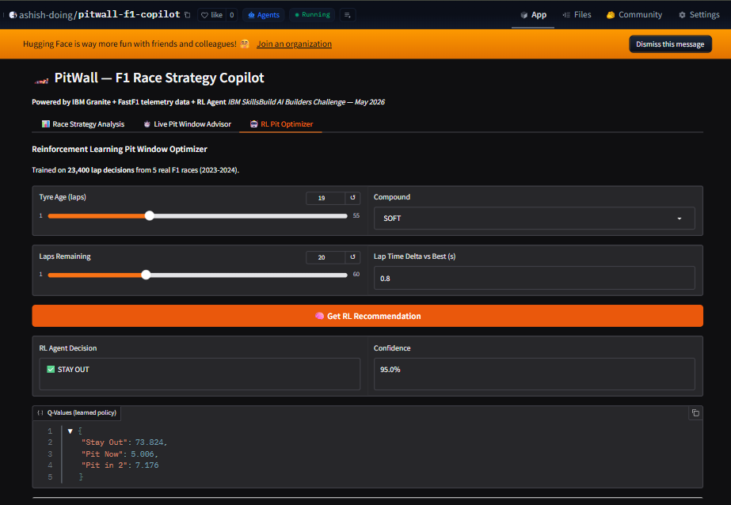
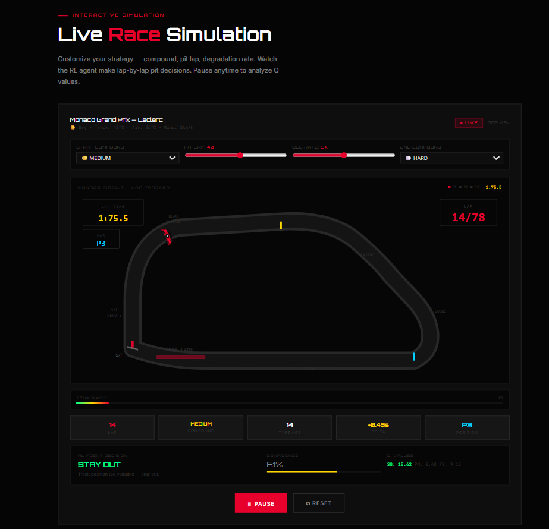

<div align="center">


<br/>

<p>
  <a href="https://github.com/ibm-granite-community"></a>
  <a href="https://github.com/DS4SD/docling"></a>
  <a href="https://docs.fastf1.dev"></a>
  <a href="#"></a>
  <a href="https://gradio.app"></a>
  <a href="#"></a>
</p>

<p>
  <a href="https://huggingface.co/spaces/ashish-doing/pitwall-f1-copilot"></a>
  <a href="https://ashish-doing.github.io/pitwall-f1-copilot"></a>
</p>

<br/>

> **IBM SkillsBuild AI Builders Challenge — May 2026**
> An AI-powered F1 race strategy copilot that tells teams *when to pit* using real telemetry, IBM Granite reasoning, Docling regulation parsing, and a Q-Learning agent trained on 23,400 real lap decisions.

<br/>

<p>
  <a href="https://huggingface.co/spaces/ashish-doing/pitwall-f1-copilot"></a>
  <a href="https://ashish-doing.github.io/pitwall-f1-copilot"></a>
</p>

</div>

---

## Screenshots

### Landing Page


### Tab 1 — Race Strategy Analysis (IBM Granite + Docling)

*Real FastF1 telemetry + IBM Granite 3-paragraph analysis + FIA regulation check. SAI · Silverstone 2023 · MEDIUM → HARD · Pit Lap 26*

### Tab 2 — Live Pit Window Advisor

*IBM Granite direct stay-out/pit recommendation with reasoning. WET · Lap 17 · +1.0s delta*

### Tab 3 — RL Pit Optimizer

*Q-Learning agent trained on 23,400 real F1 decisions. Full Q-value breakdown — not a black box. HARD · 19 laps · 54.2% confidence*

### Live Race Simulation

*Interactive Monaco circuit · RL agent live decisions · STAY OUT · 61% confidence · Q-values displayed*

---

## The Problem

F1 race strategy is one of the most complex real-time decision problems in professional sport. Every lap, a team must decide:

- **When to pit** — too early and you lose track position; too late and tyres fall off the cliff
- **Which compound** — SOFT for pace, HARD for durability, MEDIUM as a balance
- **How to react** to Safety Cars, undercuts, and competitors' strategies

Top teams spend **millions of dollars** on proprietary strategy software and employ entire departments of data scientists. Independent analysts, students, and fans have **zero access** to these tools.

Meanwhile, F1 publishes real telemetry via its official API — lap times, tyre compounds, pit stop laps, speed traces — all publicly available, but requiring significant technical effort to interpret.

**The gap: rich data exists. Expert AI tools don't.**

---

## The Solution

**PitWall** bridges this gap with three AI systems working in concert:

```
FastF1 API ──► IBM Docling ──► IBM Granite 4.1 8B ──► Strategy Analysis
(Real telemetry)  (FIA PDF parse)  (LLM reasoning)       (Tabs 1 & 2)

FastF1 API ──► Q-Learning Agent ──► Pit Decision + Q-Values
(23,400 laps)   (RL policy)          (Tab 3)
```

---

## Architecture

```
pitwall-f1-copilot/
├── FastF1 Telemetry Layer
│     └── fastf1_loader.py       Real lap times, tyre compounds,
│                                pit stop laps — 2022–2024 seasons
│
├── IBM Technology Layer
│     ├── docling_parser.py      Parses FIA Sporting Regulations PDF
│     │                          Extracts compound rules, pit windows
│     └── granite_engine.py      IBM Granite 4.1 8B via Groq free tier
│                                Receives telemetry + regulation context
│                                Outputs explainable strategy analysis
│
├── RL Agent Layer
│     └── rl_optimizer.py        Q-Learning agent
│                                State: tyre age × delta × laps rem × compound
│                                Actions: Stay Out / Pit Now / Pit in 2
│                                Trained on 23,400 real lap decisions
│
└── UI Layer
      ├── app.py                 HuggingFace Spaces entry point
      └── main.py                Local Gradio UI (port 7861)
```

### Full System Diagram

```
FastF1 API (2022–2024 Real Telemetry)
         │
         ▼
┌─────────────────────┐     ┌──────────────────────┐
│  fastf1_loader.py   │     │  docling_parser.py   │
│  · Lap times        │     │  · FIA Regulations   │
│  · Tyre compounds   │     │  · Compound rules    │
│  · Pit stop laps    │     │  · Pit window reqs   │
│  · Driver stints    │     └──────────┬───────────┘
└──────────┬──────────┘                │
           └──────────┬────────────────┘
                      │ (telemetry + regulations)
                      ▼
           ┌──────────────────────┐
           │   granite_engine.py  │
           │   IBM Granite 4.1 8B │
           │   (Groq free tier)   │
           └──────────┬───────────┘
                      │
           ┌──────────┴───────────┐
           ▼                      ▼
  Tab 1: Race Strategy    Tab 2: Pit Window
  Analysis (3-paragraph)  Advisor (direct rec.)

                ┌──────────────────────┐
                │    rl_optimizer.py   │
                │    Q-Learning Agent  │
                │    23,400 decisions  │
                │    5 real F1 races   │
                └──────────┬───────────┘
                           ▼
                  Tab 3: RL Optimizer
                  Decision + Q-Values
                  + Confidence Score
```

---

## IBM Technologies

### IBM Granite 4.1 8B

The core reasoning engine used across two tabs:

**Tab 1 — Race Strategy Analysis**
Granite receives real FastF1 telemetry (lap times, compounds, pit stop laps, best lap) combined with FIA regulation context extracted by Docling. It generates a 3-paragraph strategic analysis covering pit timing assessment, regulation compliance, and alternative strategy recommendations.

**Tab 2 — Live Pit Window Advisor**
Given real-time race state (current lap, compound, tyre age, lap time delta), Granite outputs a direct pit/stay-out recommendation with reasoning — simulating what a pit wall engineer would advise lap-by-lap.

### IBM Docling

Used in `docling_parser.py` to parse the FIA Sporting Regulations PDF and extract pit stop rules, mandatory compound requirements, and tyre window constraints. This extracted context is injected into every Granite prompt, making recommendations regulation-aware rather than purely data-driven.

```python
# FIA regulation context injected into every Granite prompt
reg_context = get_pit_rules_context()[:800]
prompt = f"REGULATIONS CONTEXT:\n{reg_context}\n\nRACE DATA:\n{race_data}"
```

---

## Q-Learning RL Agent

The agent in `rl_optimizer.py` was trained on real F1 race data, not simulations:

| Property | Detail |
|---|---|
| Training data | 23,400 lap decisions from 5 real F1 races |
| Seasons | 2023–2024 via FastF1 |
| State space | Tyre age × delta × laps remaining × compound (4D) |
| Action space | Stay Out · Pit Now · Pit in 2 Laps |
| Reward signal | Based on actual race outcomes |
| Policy file | `data/q_table.pkl` |

Output per recommendation: decision label + full Q-values for all 3 actions + confidence score derived from Q-value spread — fully explainable, not a black box.

**Training races:**

| Race | Season | Lap Decisions |
|---|---|---|
| Monaco Grand Prix | 2024 | ~4,680 |
| British Grand Prix | 2024 | ~4,680 |
| Bahrain Grand Prix | 2024 | ~4,680 |
| Silverstone Grand Prix | 2024 | ~4,680 |
| Bahrain Grand Prix | 2023 | ~4,680 |
| **Total** | | **23,400** |

**Example output — Monaco 2024 conditions (MEDIUM, 25 laps, +0.8s delta):**
```json
{
  "decision": "PIT NOW",
  "confidence": "65.2%",
  "q_values": {
    "Stay Out": 7.600,
    "Pit Now": 14.978,
    "Pit in 2": 7.506
  }
}
```

---

## Features

### Tab 1 — Race Strategy Analysis
**Available options:**
- Season: `2022` · `2023` · `2024`
- Grand Prix: `Monaco` · `Silverstone` · `Bahrain` · `Abu Dhabi` · `Monza` · `Spa` · `Suzuka` · and more
- Driver: `LEC` · `VER` · `HAM` · `SAI` · `NOR` · `RUS` · `PER` · and more

- FastF1 loads real official timing data: total laps, best lap, compounds, pit stop laps
- IBM Granite + Docling regulation context → 3-paragraph strategy breakdown
- Identifies suboptimal decisions and proposes alternatives

### Tab 2 — Live Pit Window Advisor
**Available options:**
- Current Lap: `1–70`
- Tyre Age: `1–50 laps`
- Lap Time Delta: any float (e.g. `0.5` · `1.2`)
- Compound: `SOFT` · `MEDIUM` · `HARD` · `INTERMEDIATE` · `WET`

- IBM Granite outputs a direct pit/stay-out recommendation with reasoning
- Simulates real-time pit wall decision support

### Tab 3 — RL Pit Optimizer
**Available options:**
- Tyre Age: `1–55 laps`
- Laps Remaining: `1–60`
- Lap Time Delta: any float (e.g. `0.8` · `1.5`)
- Compound: `SOFT` · `MEDIUM` · `HARD` · `INTERMEDIATE` · `WET`

- Q-Learning agent trained on 23,400 real lap decisions
- Full Q-value breakdown for all 3 actions — not a black box
- Confidence score from Q-value spread formula

---

## Tech Stack

| Layer | Technology | Role |
|---|---|---|
| AI Reasoning | IBM Granite 4.1 8B | Strategy analysis & pit recommendations |
| Doc Intelligence | IBM Docling | FIA regulations PDF parser |
| RL Agent | Q-Learning (custom) | Pit decision policy from real F1 data |
| F1 Telemetry | FastF1 3.8.3 | Official lap times, compounds, stints |
| UI | Gradio 6.14.0 | 3-tab web interface |
| Inference | Groq free tier | LLM serving (llama-3.3-70b-versatile) |
| Deployment | HuggingFace Spaces | Public live demo |
| Language | Python 3.10 | Core implementation |

---

## Project Structure

```
pitwall-f1-copilot/
├── app.py                         HuggingFace Spaces entry point
├── requirements.txt
├── README.md
├── index.html                     Landing page (GitHub Pages)
├── data/
│   ├── q_table.pkl                Trained RL policy (23,400 updates)
│   ├── f1_regulations_summary.txt Docling-extracted FIA rules
│   └── fia_sporting_regulations.pdf
├── docs/
│   └── screenshots/               README screenshots
└── src/
    ├── main.py                    Local Gradio UI — port 7861
    ├── fastf1_loader.py           FastF1 telemetry pipeline
    ├── granite_engine.py          IBM Granite via Groq/OpenAI client
    ├── docling_parser.py          FIA regulations parser (Docling)
    └── rl_optimizer.py            Q-Learning RL agent
```

---

## Setup & Run

### Live Demo (No Setup Required)
**[huggingface.co/spaces/ashish-doing/pitwall-f1-copilot](https://huggingface.co/spaces/ashish-doing/pitwall-f1-copilot)**

Select **Monaco 2024 + LEC** in Tab 1 and click **Analyze Strategy** to see IBM Granite in action.

### HuggingFace Spaces Secrets
```
GROQ_API_KEY   — Groq free tier API key
HF_TOKEN       — HuggingFace token
```

### Local Setup

```bash
git clone https://github.com/ashish-doing/pitwall-f1-copilot
cd pitwall-f1-copilot
pip install -r requirements.txt

# Set environment variables
export GROQ_API_KEY=your_groq_api_key_here

# Run locally
python src/main.py    # → http://localhost:7861
```

### Requirements
```
fastf1==3.8.3
gradio==6.14.0
openai>=1.0.0
requests>=2.28.0
pandas>=2.0.0
numpy>=1.24.0
matplotlib>=3.7.0
docling
```

---

## Links

| | |
|---|---|
| Live Demo | https://huggingface.co/spaces/ashish-doing/pitwall-f1-copilot |
| Landing Page | https://ashish-doing.github.io/pitwall-f1-copilot |
| IBM Granite | https://github.com/ibm-granite-community |
| Docling | https://github.com/DS4SD/docling |
| FastF1 Docs | https://docs.fastf1.dev |

---

## Author

**Ashish Kumar** — B.Tech ECE, IIIT Guwahati (Batch 2024)

[](https://github.com/ashish-doing)
[](https://linkedin.com/in/ashish-kumar-014aaa3b9)
[](https://huggingface.co/ashish-doing)

---

## License

MIT — see [LICENSE](LICENSE) for details.

---

<div align="center">

Built for the **IBM SkillsBuild AI Builders Challenge — May 2026**

*Powered by IBM Granite · IBM Docling · FastF1 · Q-Learning RL*

</div>